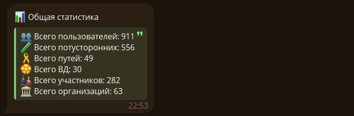
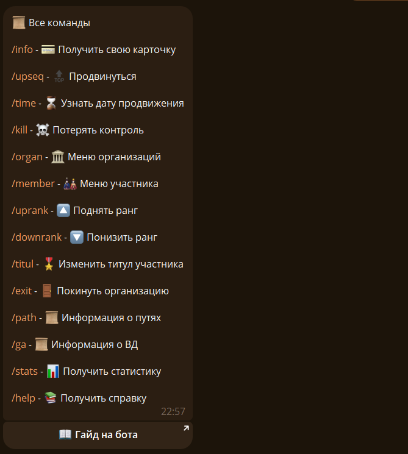
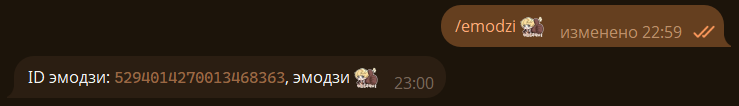
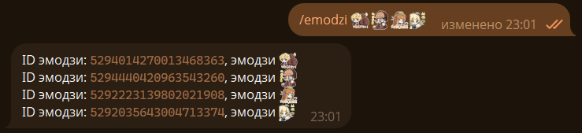

## 📊 Получить статистику {#stats}

Чтобы получить статистику бота используйте команду `/stats`:

## 📚 Получить справку {#help}

Чтобы получить краткую справку используйте команду `/help`:

## 😀 Получить ID кастомного эмодзи {#emodzi}

Чтобы получить ID кастомного эмодзи используйте команду `/emodzi`, вписав после команды нужный эмодзи:

Можно несколько:

