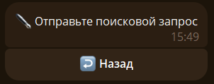
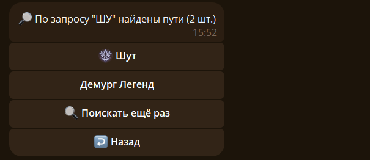

## 📊 Получить общую статистику {#stats}

Чтобы получить статистику бота используйте команду `/stats`:

## 🧪 Получить статистику пути {#stats-paths}

Чтобы получить статистику пути используйте команду `/stats` и нажмите на кнопку `🔍 Статистика путей`:

Вводим название пути: 

Выбираем нужный путь
<!--stats-path-start-->

<!--stats-path-end-->
Если нажать на одного из потусторонних, получим его карточку:



## 📚 Получить справку {#help}

Чтобы получить краткую справку используйте команду `/help`:

## 😀 Получить ID кастомного эмодзи {#emodzi}

Чтобы получить ID кастомного эмодзи используйте команду `/emodzi`, вписав после команды нужный эмодзи:

Можно несколько:

