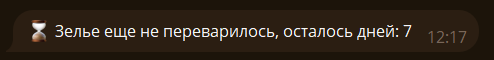
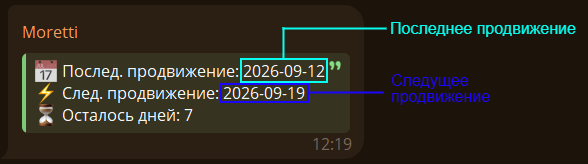
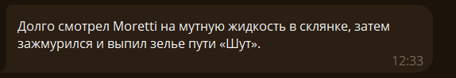
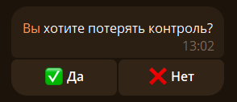
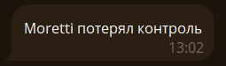

Основная механика Старого Нила.

## 🧪 Выпить зелье {#drink}

<!--drink-start-->

Чтобы стать потустронним используйте команду `/path`:

Выбираем путь и нажимаем на кнопку с названием Пути:

После нажатия кнопки получаем примерно такое сообщение: 

Поздравляю, мы стали потусторонним 9 последовательности.

<!--drink-end-->

## 🔝 Продвинуться {#upseq}

Чтобы перейти на следущюю последовательность, нужно переваривать зелье. 

Проверить сколько дней осталось можно с помощью команды `/upseq`:

Или `/time`, если хотите увидеть полную информацию: 

Как только настанет дата продвижения можно использовать `/upseq`, чтобы перейти на следущюю последовательность:

## ☠️ Потерять контроль {#kill}

Чтобы потерять контроль используйте команду `/kill`:

Нажав на кнопку `Да` вы потеряете контроль и перестанете быть потусторонним. 

Теперь вы можете выбрать другой путь и снова пойти по пути Потусторонних