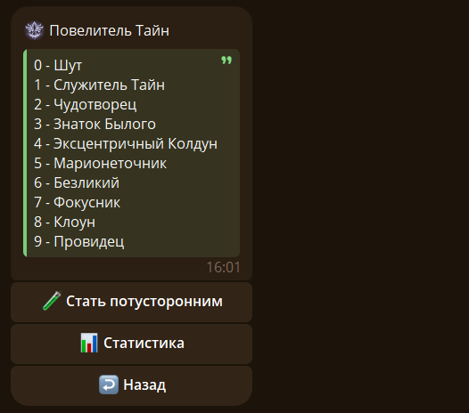
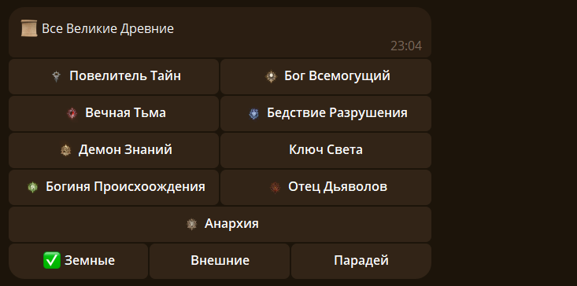
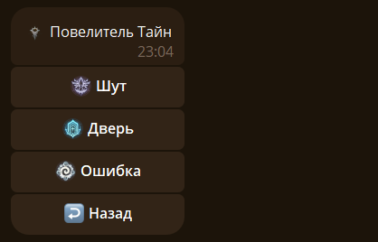
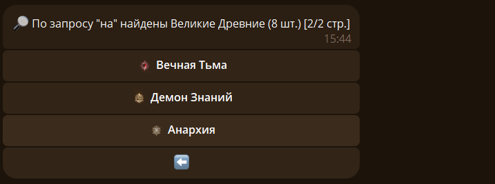

## 📚 Меню {#menu}
<!--wiki-menu-start-->
Чтобы получить меню используйте команду `/wiki`:

<!--wiki-menu-end-->
## 🧪 Пути {#path}

Чтобы получить список всех путей используйте команду `/path`:

Выбираем путь и нажимаем на соотвествующую кнопку:

Нажав на кнопку `📊 Статистика` мы получим статистику этого пути:



## 🪐 Великие Древние {#ga}

> ❗Сокращение ВД - Великий Древний

Чтобы получить список всех ВД используйте команду `/ga`:

Выбираем ВД и нажимаем на соотвествующую кнопку:

Если нажать на один из путей появится знакомая менюшка:

> ❗Если путей у ВД один, то откроется сразу менюшка пути.

## 🔍 Поиск {#search}

Чтобы найти путь используйте команду `/path поисковой запрос`, вставив запрос в нужное место:

> ❗Бот ищет не только по названию пути, но и по названиям последовательности.

Чтобы найти ВД используйте команду `/ga поисковой запрос`, вставив запрос в нужное место:

