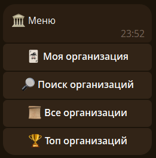
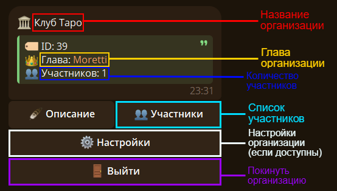
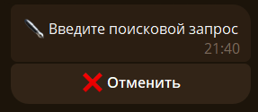
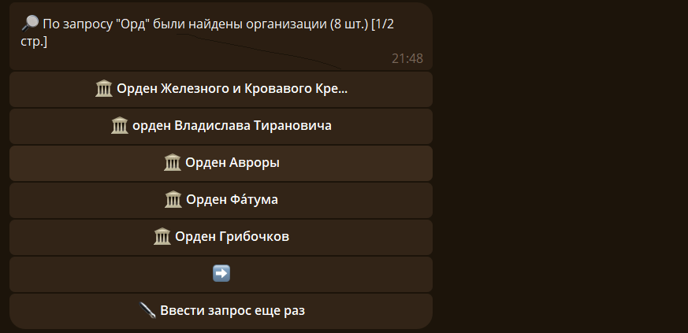
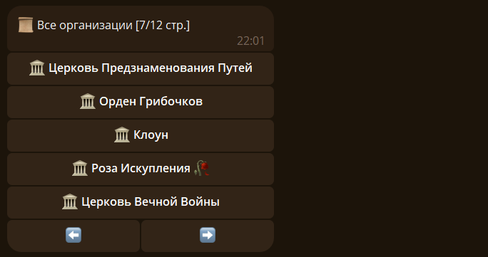
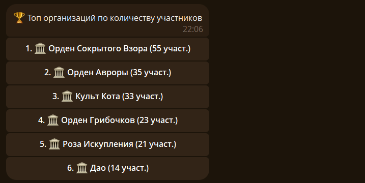

Основная команда - `/organ`. При отправке без субкоманды, появится меню организаций: 

`🃏 Моя организация` - [Карточка вашей организации](#info)

`🔎 Поиск организаций` - [Поиск организации](#search)

`📜 Все организации` - [Список всех организации](#list)

`🏆 Топ организаций` - [Топ организаций по еоличеству участников](#top)

## 🎴 Карточка организаций {#info}

Чтобы получить свою или чужую карточку организации используйте команду `/organ info`:

При нажатии на кнопку `👥 Участники` появится [список участников](./members.md).

При нажатии на кнопку `⚙️ Настройки` появятся [настройки организации](./myorgan.md#setting).

## 🔍 Поиск {#search}

Чтобы найти нужную организацию, используйте команду `/organ search`:

Вводим поисковой запрос и получаем список найденных организаций: 

## 📜 Список всех организаций {#list}

Чтобы получить список, используйте команду `/organ list`:

## 🔝 Топ организаций {#top}

Чтобы получить топ по количеству участников, используйте команду `/organ top`:

