Чтобы получить список участников отправьте `/organ members`:

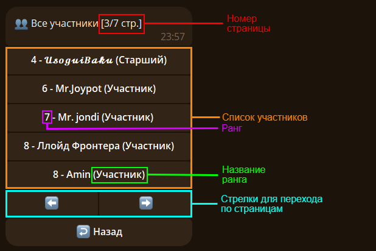

Нажав на одну из кнопок с участниками мы получим [карточку участника](#member).

## 🎴 Карточка участника {#member}

Чтобы получить свою карточку используйте `/organ member`:

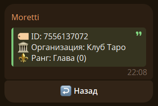

Если хотите карточку другого используйте `/organ member` ответив на его сообщение:

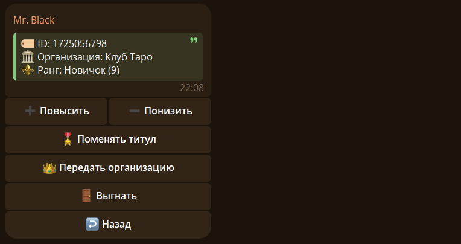

## 🔰 Ранги {#rank}

Существуют 10 рангов: с 9 по 0

0 ранг модет быть только у одного человека (у владельца организации)

Чтобы повысить человка отвеьте на его сообщение командой `/organ uprank` (можно `/uprank`) или нажимайте на кнопку `➕ Повысить` в его карточке участника.

После повышения увидим такое сообщение: 

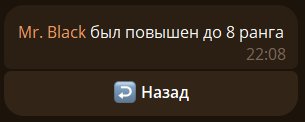

Чтобы понизить ранг человка отвеьте на его сообщение командой `/organ downrank` (можно `/downrank`) или нажимайте на кнопку `➖ Понизить` в его карточке участника.

После понижения увидим такое сообщение: 

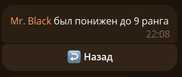

## 🃏 Титулы {#titul}

Если хотите дать/изменить титул участнику отвеьте на его сообщение командой `/organ titul` (можно `/titul`) или нажимайте на кнопку `🎖️ Поменять титул` в его карточке участника:

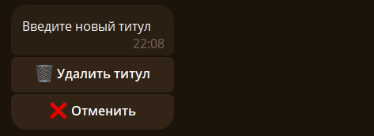

Отправляем ему новый титул, например "Чёрный": 

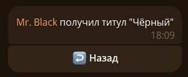

Чтобы удалить титул нажмите на кнопку `🗑️ Удалить титул`:

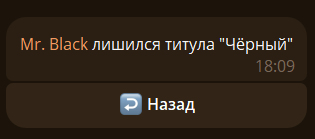

## 🥊 Выгнать участника {#kick}

Чтобы выгнать нажмите на кнопку `🚪 Выгнать` или отвеьте на сообщение участника командой `/organ kick`:

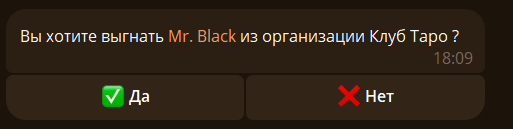

Нажимаем на `✅ Да` и исключаем участника из нашей организации:

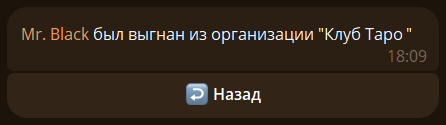

## 🎭 Передача организации {#give}

Чтобы передать организацию участнику нажмите на кнопку `👑 Передать организацию` или отвеьте на его сообщение командой `/organ give`:

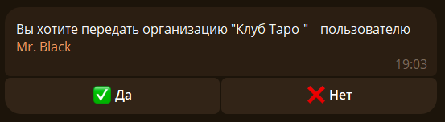

Нажимаем на `✅ Да` и передаем организацию участнику:

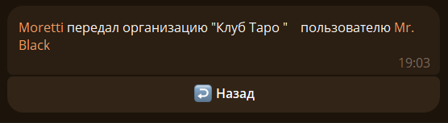
