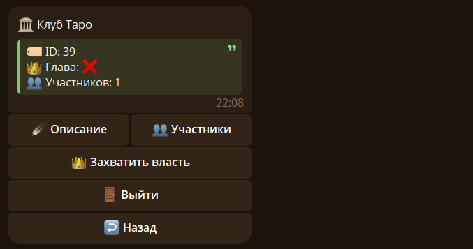
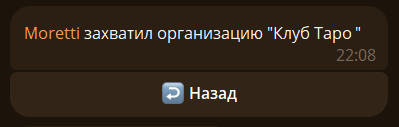
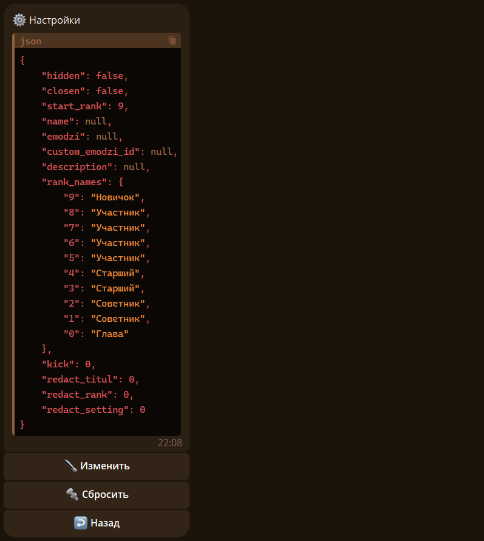
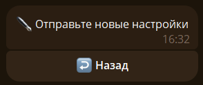
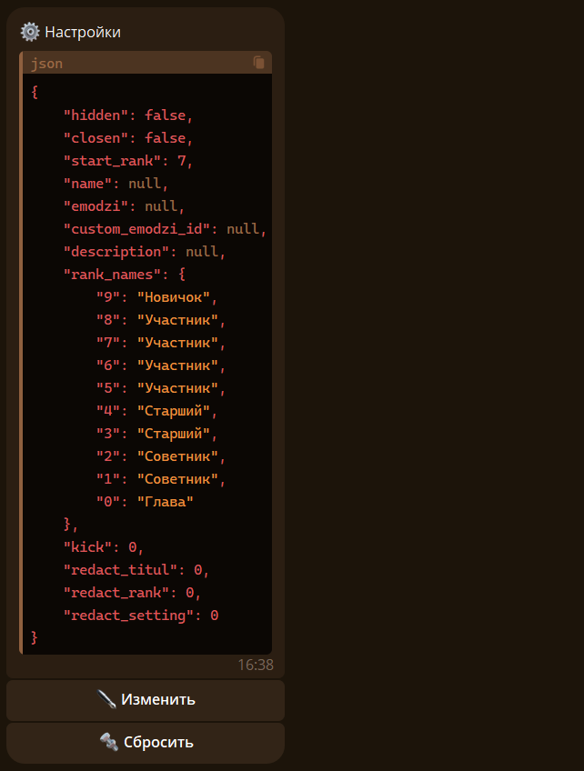

## 👑 Захват организации {#capture}

Если нету главы организации, ее можно захватить.



Для этого нажмите на кнопку `👑 Захватить власть` в карточке организации или используйте команду `/organ capture`: 



## ⚙️ Настройки {#setting}

Чтобы открыть меню настроек, используйте команду `/organ setting`: 



??? note "JSON-вид настроек"

    ```json
    {
        "hidden": false,
        "closen": false,
        "start_rank": 9,
        "name": null,
        "emodzi": null,
        "custom_emodzi_id": null,
        "description": null,
        "rank_names": {
            "9": "Новичок",
            "8": "Участник",
            "7": "Участник",
            "6": "Участник",
            "5": "Участник",
            "4": "Старший",
            "3": "Старший",
            "2": "Советник",
            "1": "Советник",
            "0": "Глава"
        },
        "kick": 0,
        "redact_titul": 0,
        "redact_rank": 0,
        "redact_setting": 0
    }
    ```

### 🔧 Редактирование {#setting_redact}

Чтобы редактировать настройки нажмите на кнопку `✒️ Изменить`:



После этого нужно отправить новые параметры, к примеру вводим это `{"start_rank": 7}`:



Как видим, поле "start_rank" изменилось. 

Чтобы изменить параметры, важно отправлять параметры в виде словаря (из Python):

1. Названия и значения параметров важно заключять внутри фигурных скобок.

2. Названия должно быть строго такими же как в настройках и внутри кавычек.

3. После названия параметра должно стоять двоеточие, и потом его значение.

4. Вид значения зависит от параметра. Может быть числом, строкой, булевым значением или словарем.

5. Если параметров для изменения несколько перечисляйте их через запятую.

6. Порядок параметров не важен.

Пример сообщения для изменения настроек:

```json
{
    "redact_titul": 3,
    "redact_rank": 2,
    "description": ":)",
    "rank_names": {
        "9": "Новая кровь",
        "8": "Полукровка",
        "0": "Прародитель"
    },
    "hidden": true
}
```


>❗ Булевое значение - это значение, которое может быть либо false, либо true.

### 🔩 Все Параметры {#setting_all_paremetrs}

#### 🎨 Внешний вид {#setting_paremetr_appearance}

##### 🔖 Название {#setting_paremetr_name}

Чтобы изменить название организации используйте этот шаблон:

```json
{"name":"новое название"}
```

##### 😀 Эмодзи {#setting_paremetr_emodzi}

Чтобы изменить эмодзи используйте этот шаблон:

```json
{"emodzi":"новое эмодзи"}
```

>❗Кастомные эмодзи - эмодзи создаваемые пользователями и доступные для использования только по Telegram-премиуму.

Чтобы изменить кастомное эмодзи используйте этот шаблон:

```json
{"custom_emodzi_id":"ID кастомного эмодзи"}
```


>❗Если вы указали и обычное эмодзи и кастомное, то всем будет показывать кастомное.

##### 📜 Описание {#setting_paremetr_description}

Чтобы изменить описание используйте этот шаблон:

```json
{"description":"новое описание"}
```

##### 🎎 Названия рангов {#setting_paremetr_rank_names}

Чтобы изменить названия рангов используйте этот шаблон:

```json
{"rank_names": {
        "9": "новое название для 9 ранга",
        "8": "новое название для 8 ранга",
        ...
        "1": "новое название для 1 ранга",
        "0": "новое название для Главы"
    }}
```
#### ⚙️ Основные настройки {#setting_paremetr_main}

##### 🥷 Приватность {#setting_paremetr_hidden}

Этот параметр влияет на возможность НЕУЧАСТНИКАМИ организации просматривать информацию о вашей организации. Если `true` то больше никто, кроме участников организации, не сможет просматривать карточку организации. По умолчанию `false`.

Чтобы изменить приватность используйте этот шаблон:

```json
{"hidden":bool}
```

>❗Вместо `bool` поставьте значение `true` (включить) или `false` (выключить).

##### 🚪 Закрытый Вход {#setting_paremetr_closen}

Этот параметр влияет на возможность присоединяться к вашей организации. Если `true` то больше никто не сможет войти в организацию. По умолчанию `false`.

Чтобы изменить вход используйте этот шаблон:

```json
{"closen":bool}
```

>❗Вместо `bool` поставьте значение `true` (включить) или `false` (выключить). Без кавычек. 

##### 🏁 Начальный ранг {#setting_paremetr_start_rank}

При входе в организацию дается ранг указанный в этом параметре. По умолчанию 9 ранг.

Чтобы изменить начальный ранг используйте этот шаблон:

```json
{"start_rank":ранг}
```

>❗Вместо `ранг` поставьте номер ранга в виде числа. Доступны только цифры от 0 до 9. Без кавычек.

#### 🛂 Разрешения {#setting_paremetr_permission}

Разрешения влияют на возможности участников организации. Только глава имеет абсолютную власть. 

>❗Если вы указали 2 ранг, например для изменения ранга, то все участники с этим рангом или выше смогут повышать или понижать.

##### 🎎 Изменение ранга {#setting_paremetr_redact_rank}

Дает возможность изменять ранги участников, у которых ранг ниже вашего. По умолчанию только глава может редактировать ранг.

Чтобы изменить уровень доступа к изменению ранга используйте этот шаблон:

```json
{"redact_rank":ранг}
```

>❗Вместо `ранг` поставьте номер ранга в виде числа. Доступны только цифры от 0 до 9. Без кавычек.

##### 🎖️ Изменение титула {#setting_paremetr_redact_titul}

Дает возможность изменять титулы участников, у которых ранг ниже вашего. По умолчанию только глава может редактировать титул.

Чтобы изменить уровень доступа к изменению титула используйте этот шаблон:

```json
{"redact_titul":ранг}
```

>❗Вместо `ранг` поставьте номер ранга в виде числа. Доступны только цифры от 0 до 9. Без кавычек.

##### 🚪 Исключение из организации {#setting_kick}

Дает возможность выгонять участников, у которых ранг ниже вашего. По умолчанию только глава может выгонять участников.

Чтобы изменить уровень доступа исключению используйте этот шаблон:

```json
{"kick":ранг}
```

>❗Вместо `ранг` поставьте номер ранга в виде числа. Доступны только цифры от 0 до 9. Без кавычек.

##### 🔧 Изменение настроек {#setting_paremetr_redact_setting}

Дает возможность редактировать настройки организации. По умолчанию только глава может редактировать настройки организации.

>❗Не давайте это разрешение без крайной необходимости и тем кому не доверяете.

Чтобы изменить уровень доступа к изменению используйте этот шаблон:

```json
{"redact_setting":ранг}
```

>❗Вместо `ранг` поставьте номер ранга в виде числа. Доступны только цифры от 0 до 9. Без кавычек.
