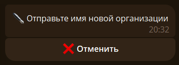
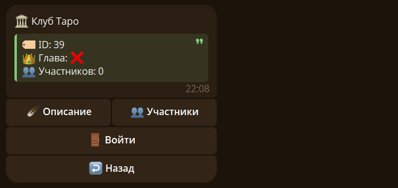
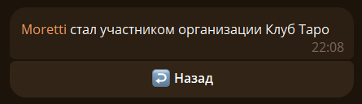
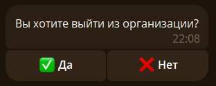
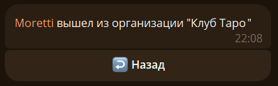

## ➕ Создание организаций {#create}

Чтобы создать организацию используйте команду `/organ create`:

Вводим имя новой организации:

`🃏 Моя организация` - [Карточка вашей организации](./main.md#info)

## 🚪 Вход {#login}

Находим нужную организацию и нажимаем на кнопку `🚪 Войти`:

После успешного входа видим такое сообщение: 

После входа, обратитесь к старшему, чтобы получить больше информации о устройстве организации.

## 🚷 Выход {#exit}

Чтобы выйти из организации нажимаем на кнопку `🚪 Выйти` в карточке организации или используем команду `/organ exit` (можно `/exit`):

> ❗После выхода вы потеряете свой ранг и титул

После успешного выхода видим такое сообщение: 

Теперь вы можете войти в другие организации.
