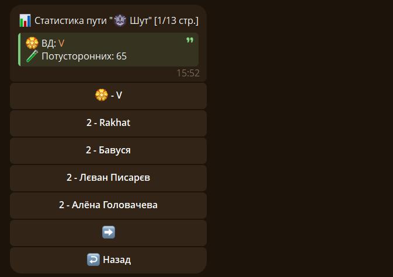

Сегодня, 9 октября, выпущена новая версия Старого Нила.

## 📊 Возвращение старой функции /stats

Теперь снова доступен просмтор статистики путей и списка потумторонних:

## 📚 Новое Вики-меню



Небольшое обновление правда получилось, зато долгожданная функция /stats вернулась)

