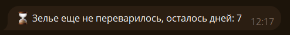
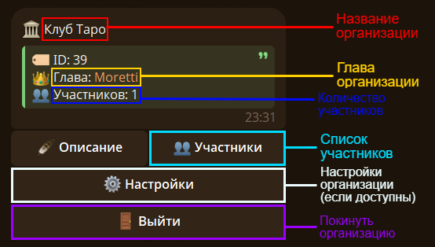
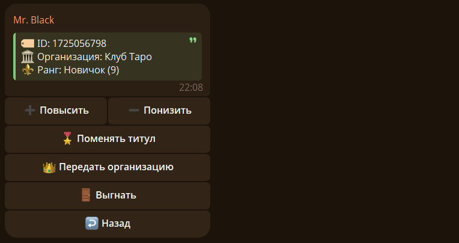
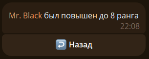
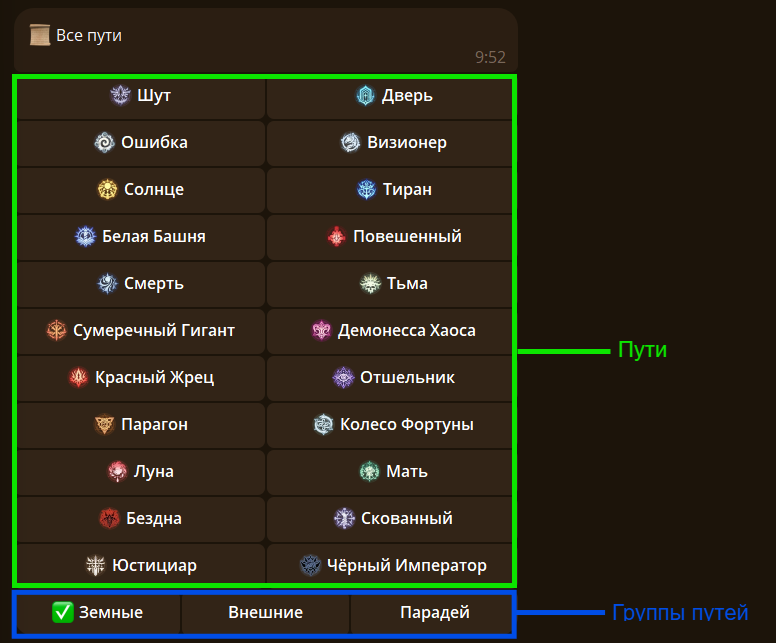
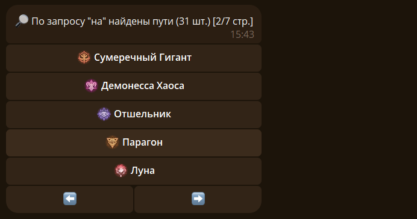

Сегодня, 21 сентября, состоялся релиз Старого Нила 2.

## 🖥️ Новый интерфейс и обновленные сообщения

Я обновил текст некотрых команд и добавил кнопки:

## 🏦 Организации возвращаются

Изменения рангов, настройки, захват организации снова доступны:

## 🧪 Удобный список путей и обновленный поиск

Список путей был переработан, а поиск улучшен:

В этом обновлении еще много чего было добавлено или изменено, но все тут не расскажешь, но вы можете сами посмотреть, что изменилось)

